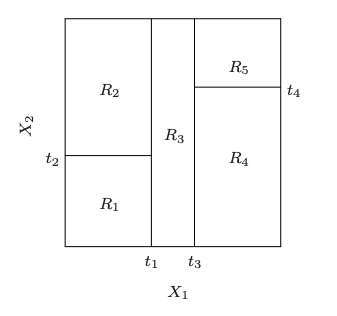

```{r setup, include=FALSE}
options(htmltools.dir.version = FALSE)
knitr::opts_chunk$set(warning = FALSE, message = FALSE, 
  comment = NA, dpi = 300, echo = FALSE, echo = FALSE, 
  fig.align = "center", out.width = "80%", cache = FALSE)
library(tidyverse)
```

class:  title-slide
background-image: url(img/ap.png)
background-size: cover


.footnote[
# `r rmarkdown::metadata$title`
### `r rmarkdown::metadata$author`,
### `r rmarkdown::metadata$subtitle`,
### `r rmarkdown::metadata$date`
]


???

---
name: hello
class: inverse, left, bottom


.pull-left[
[GitHub: @brunaw](http://github.com/brunaw)  
[Site: http://brunaw.com/](http://brunaw.com/)  
[Twitter: @bwundervald](http://twitter.com/bwundervald)  
]


# Find me


  - Ph.D. Candidate in Statistics at the 
  [Hamilton Institute, Maynooth University](https://www.maynoothuniversity.ie/hamilton)
  
  - Especially interested in tree-based models:
    - Regularization in Random Forests
    - Bayesian Additive Regression Trees (BART)

  


???

Here is my contact information.


---
class: inverse, right, bottom

## Links 

`pt-br`: http://brunaw.com/slides/satrday-sp/tidyverse-para-AM.html
`en`: http://brunaw.com/slides/satrday-sp/tidyverse-for-ml.html

GitHub Repository: https://github.com/brunaw/satRday-sp-talk

---


# Introduction

- Thanks to the `tidyverse`, nowadays it's much easier to 
create nested workflows of data wrangling and analysis in `R`

- However, we can beyond that and use the `tidyverse` for the whole
modeling process as well

- How?

```{r echo = FALSE, out.width="100%"}
knitr::include_graphics("img/pacotes.png")
```


???


---

# Tidy-data

```{r echo = FALSE, out.width="100%"}
knitr::include_graphics("img/tidy_data.png")
```

```{r echo = FALSE, out.width="20%"}
knitr::include_graphics("img/hadley.jpg")
```


---

# Data 

- About the daily number of people using the Clark and Lake station in
Chicago (in thousands)

> Goal: to predict this variable and find the optimal variables
for that

- Predictors:
  - Date  
  - Weather information
  - Sport teams schedules
  - +


---

# Loading data and visualizing

```{r
library(tidyverse)
library(ranger)

data <- dials::Chicago

dim(data)
```


```{r}
library(tidyverse)
library(ranger)

data <- dials::Chicago

dim(data)
```


```{r
data %>%  
  ggplot(aes(x = ridership)) +
  geom_density(fill = "#919c4c", alpha = 0.8) +
  labs(x = "Response Variable", y = "Density") +
  theme_classic()
```


---

```{r, out.width="60%", echo = FALSE}
data %>%  
  ggplot(aes(x = ridership)) +
  geom_density(fill = "#919c4c", alpha = 0.8) +
  labs(x = "Response Variable", y = "Density") +
  theme_classic()

```


---

.pull-left[


```{r, out.width="95%", echo = FALSE}
data %>%  
  ggplot(aes(x = ridership)) +
  geom_density(fill = "#919c4c", alpha = 0.8) +
  labs(x = "Response Variable", y = "Density") +
  annotate(xmin = 0, xmax = 10, 
           ymin = -Inf, ymax = Inf, 
           colour = "black",
           geom = "rect", alpha = 0) +
    annotate(xmin = 17.5, xmax = 25, 
           ymin = -Inf, ymax = Inf, 
           colour = "black",
           geom = "rect", alpha = 0) +
  annotate(xmin = 12, xmax = 17, 
           ymin = -Inf, ymax = Inf, 
           colour = "black",
           geom = "rect", alpha = 0) +
  theme_classic()
```


]

.pull-right[

- Interesting distribution!
- Good for tree-based models

```{r echo = FALSE, out.width="70%"}
knitr::include_graphics("img/tree.png")
```

]


---

## Replicating the same dataset

```{r
data_tibble <- rep(list(data), 10) %>% 
  enframe(name = 'index', value = 'data')
data_tibble
```

```{r}
data_tibble <- rep(list(data), 10) %>% 
  enframe(name = 'index', value = 'data')
data_tibble
```


.callout[The `data` column is now a list of tibbles!]

---

## Splitting in train (75%) and test (25%) sets

```{r
train_test <- function(data){
  data %>% 
    mutate(base = ifelse(runif(n()) > 0.75, "test", "train")) %>% 
    split(.$base) %>% 
    purrr::map(~select(.x, -.data[["base"]])) }

data_tibble <- data_tibble %>% 
*  mutate(train_test = purrr::map(data, train_test))
print(data_tibble, n = 3)
```


```{r, echo = FALSE}
train_test <- function(data){
  data %>% 
    mutate(base = ifelse(runif(n()) > 0.75, "test", "train")) %>% 
    split(.$base) %>% 
    purrr::map(~select(.x, -.data[["base"]])) }

data_tibble <- data_tibble %>% 
  mutate(train_test = purrr::map(data, train_test))
print(data_tibble, n = 3)
```


.callout[The `train_test` column is a list with two elements:
the train and test sets]

---

```{r echo = FALSE, out.width="50%"}
knitr::include_graphics("img/next.jpeg")
```


---

## Modelling: tree-based methods


- Many similar models with different hyperparameter configuration

.pull-left[
```{r echo = FALSE, out.width="70%"}

```
]

.pull-right[
```{r echo = FALSE, out.width="70%"}

```
]


---

## Modelling: tree-based methods

  - Trees (CART): 1 tree, $\texttt{mtry}$ = all available variables
  
  - *Bagging*: average of many trees, $\texttt{mtry}$ = # all available variables


  - Random Forest: average of many trees, $\texttt{mtry} \approx \sqrt{\text{# all available variables}}$
  
  - Regularized Random Forests: average of many trees,, $\texttt{mtry} \approx \text{# all available variables}/2$, 
  variable gain penalized by a factor between 0 and 1 to regularize
  

(More about Regularized Random Forests in: http://brunaw.com/slides/seminar-serie/presentation.html)
  


---

Creating a function to fit all the models:


```{r
modelling <- function(train, 
                      mtry = NULL, 
                      num.trees = NULL, 
                      coef.reg = 1, 
                      formula = ridership ~ .) {
  
  ranger::ranger(formula, 
                 data = train, 
                 num.trees = num.trees,
                 mtry = mtry, 
                 importance = "impurity", 
                 regularization = list(coef.reg = coef.reg))
}
```

```{r}
modelling <- function(train, 
                      mtry = NULL, 
                      num.trees = NULL, 
                      coef.reg = 1, 
                      formula = ridership ~ .) {
  
  ranger::ranger(formula, 
                 data = train, 
                 num.trees = num.trees,
                 mtry = mtry, 
                 importance = "impurity", 
                 regularization = list(coef.reg = coef.reg))
}
```


> Note: this version of the `ranger` package is available at
https://github.com/regularization-rf/ranger (November 30), 
to be added to the core package soon

---

Nesting models:

```{r
models <- list(
  tree = list(mtry = ncol(data) - 1, num.trees = 1, coef.reg = 1),
  bagging = list(mtry = ncol(data) - 1, num.trees = 100, coef.reg = 1), 
  forest = list(mtry = sqrt(ncol(data) - 1), num.trees = 100, coef.reg = 1),
  regularized_forest07 =  list(mtry = (ncol(data) - 1)/2, num.trees = 100, coef.reg = 0.7),
  regularized_forest02 =  list(mtry = (ncol(data) - 1)/2, num.trees = 100, coef.reg = 0.2)) %>% 
  enframe(name = 'model', value = 'parameters')

models
```

```{r}
models <- list(
  tree = list(mtry = ncol(data) - 1, num.trees = 1, coef.reg = 1),
  bagging = list(mtry = ncol(data) - 1, num.trees = 100, coef.reg = 1), 
  forest = list(mtry = sqrt(ncol(data) - 1), num.trees = 100, coef.reg = 1),
  regularized_forest07 =  list(mtry = (ncol(data) - 1)/2, num.trees = 100, coef.reg = 0.7),
  regularized_forest02 =  list(mtry = (ncol(data) - 1)/2, num.trees = 100, coef.reg = 0.2)) %>% 
  enframe(name = 'model', value = 'parameters')

models
```


---

Adding the models to our main `tibble`:

```{r
data_tibble <- data_tibble %>% 
*  crossing(models) %>% 
  arrange(model)

data_tibble
```

```{r}
data_tibble <- data_tibble %>% 
  crossing(models) %>% 
  arrange(model)

data_tibble
```


---

Finally training all the models at once!


There are many models to run, so now you go grab a coffee, 
read a magazine...


```{r
training_models <- data_tibble %>% 
  mutate(
    full_parameters = 
*      map2(parameters, map(train_test, "train"), ~list_modify(.x, train = .y)),
*    train_model = invoke_map(modelling, full_parameters))

print(training_models, n = 5)
```

```{r}
training_models <- data_tibble %>% 
  mutate(
    full_parameters = 
      map2(parameters, map(train_test, "train"), ~list_modify(.x, train = .y)),
    train_model = invoke_map(modelling, full_parameters))

print(training_models, n = 5)
```


---

```{r echo = FALSE, out.width="70%"}

```

---

# Which are the best models?


- Metrics:

  - Root Mean Squared Error
  - Total number of variables used in the model
  - R-squared


```{r
rmse <- function(model, test){
  pp <- predict(model, test)
  sqrt(mean((pp$predictions - test$ridership)^2))
}


number_variables <- function(model){
  sum(model$variable.importance > 0)
}
```

```{r}
rmse <- function(model, test){
  pp <- predict(model, test)
  sqrt(mean((pp$predictions - test$ridership)^2))
}


number_variables <- function(model){
  sum(model$variable.importance > 0)
}
```


---

Results!

```{r
results <- training_models %>% 
  mutate(
*    rmse = map2_dbl(.x = train_model,
*                   .y = map(train_test, "test"), 
*                   ~rmse(model = .x, test = .y)),
*    number_variables = map_int(train_model, number_variables), 
*    rsquared = map_dbl(train_model, "r.squared"))

```

```{r}
results <- training_models %>% 
  mutate(
    rmse = map2_dbl(.x = train_model,
                   .y = map(train_test, "test"), 
                   ~rmse(model = .x, test = .y)),
    number_variables = map_int(train_model, number_variables), 
    rsquared = map_dbl(train_model, "r.squared"))
```


```{r,  results='asis', echo = FALSE}
library(formattable)
library(kableExtra)

tab <- results %>% 
  select(model, rmse, number_variables, rsquared) %>% 
  group_by(model) %>% 
  summarise_all(mean)

tab %>% 
  mutate_if(is.numeric, ~round(.x, 3)) %>% 
  mutate_at(vars(2, 3), 
    ~ifelse(. == min(.), color_bar("lightgreen")(.), .)) %>% 
    mutate_at(vars(4), 
    ~ifelse(. == max(.), color_bar("lightgreen")(.), .)) %>% 
  knitr::kable(escape = FALSE, format = 'html',
               caption="Mean results per model combination") %>%
  kable_styling(bootstrap_options = c("condensed", "hover"), 
                full_width = FALSE) %>% 
  column_spec(2, width = "3cm")  
```


---

All the elements in only one object!

```{r,  echo = TRUE}
results 
```


---

# Conclusions


- The `tidyverse` makes the modeling workflow in `R` very clear and 
compact

- We can build a unique object to store everything at the same time:
data, train, test, seeds, hyperparameters, fitted models, results, 
evaluation metrics, computational details, etc
  - Very useful to quickly compare models
  - Reproducibility (papers, reports)


---

# Conclusions

```{r echo = FALSE, out.width="40%"}

```


---

class: inverse, center, middle

# Thanks!


 

<b>[@brunaw](https://github.com/brunaw)<b> 

