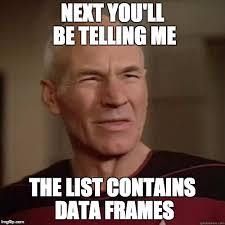

```{r setup, include=FALSE}
options(htmltools.dir.version = FALSE)
knitr::opts_chunk$set(warning = FALSE, message = FALSE, 
  comment = NA, dpi = 300, echo = FALSE, echo = FALSE, 
  fig.align = "center", out.width = "80%", cache = FALSE)
library(tidyverse)
```

class:  title-slide
background-image: url(img/ap.png)
background-size: cover


.footnote[
# `r rmarkdown::metadata$title`
### `r rmarkdown::metadata$author`,
### `r rmarkdown::metadata$subtitle`,
### `r rmarkdown::metadata$date`
]


???

---
name: hello
class: inverse, left, bottom


.pull-left[
[GitHub: @brunaw](http://github.com/brunaw)  
[Site: http://brunaw.com/](http://brunaw.com/)  
[Twitter: @bwundervald](http://twitter.com/bwundervald)  
]


# Quem sou eu 


  - Doutoranda em Estatística no 
  [Hamilton Institute, Maynooth University](https://www.maynoothuniversity.ie/hamilton)
  
  - Especialmente interessada em modelos de árvore:
    - Regularização em Florestas Aleatórias
    - Árvores de Regressão Aditivas Bayesianas (BART)
  


???

Here is my contact information.

---
class: inverse, right, bottom

## Links 

`pt-br`: http://brunaw.com/slides/satrday-sp/tidyverse-para-AM.html
`en`: http://brunaw.com/slides/satrday-sp/tidyverse-for-ml.html

Repositório no GitHub : https://github.com/brunaw/satRday-sp-talk


---


# Introdução

- Graças ao `tidyverse`, hoje em dia é muito fácil criar workflows
aninhados de análise e manipulação de dados no `R`

- Pórem, nós podemos ir muito além disso, e criar o processo
inteiro de modelagem com o `tidyverse`

- Como?

```{r echo = FALSE, out.width="100%"}

```


???


---

# Tidy-data

```{r echo = FALSE, out.width="100%"}
knitr::include_graphics("img/tidy_data.png")
```

```{r echo = FALSE, out.width="20%"}

```


???

Then you may ask them to present their work.


---

# Dados 

- Sobre a quantidade diária de pessoas (em milhares)  
usando a estação Clark and Lake em Chicago 

> Objetivo: prever essa variável e encontrar as variáveis ótimas
para o modelo

- Preditoras:
  - Data  
  - Tempo/Clima
  - Jogos de futebol acontecendo na cidade
  - +
  


---

# Carregando dados e visualizando

```{r
library(tidyverse)
library(ranger)

data <- dials::Chicago

dim(data)
```


```{r}
library(tidyverse)
library(ranger)

data <- dials::Chicago

dim(data)
```


```{r
data %>%  
  ggplot(aes(x = ridership)) +
  geom_density(fill = "#919c4c", alpha = 0.8) +
  labs(x = "Variável Resposta", y = "Densidade") +
  theme_classic()
```


---

```{r, out.width="60%", echo = FALSE}
data %>%  
  ggplot(aes(x = ridership)) +
  geom_density(fill = "#919c4c", alpha = 0.8) +
  labs(x = "Variável Resposta", y = "Densidade") +
  theme_classic()

```


---

.pull-left[


```{r, out.width="95%", echo = FALSE}
data %>%  
  ggplot(aes(x = ridership)) +
  geom_density(fill = "#919c4c", alpha = 0.8) +
  labs(x = "Variável Resposta", y = "Densidade") +
  annotate(xmin = 0, xmax = 10, 
           ymin = -Inf, ymax = Inf, 
           colour = "black",
           geom = "rect", alpha = 0) +
    annotate(xmin = 17.5, xmax = 25, 
           ymin = -Inf, ymax = Inf, 
           colour = "black",
           geom = "rect", alpha = 0) +
  annotate(xmin = 12, xmax = 17, 
           ymin = -Inf, ymax = Inf, 
           colour = "black",
           geom = "rect", alpha = 0) +
  theme_classic()
```


]

.pull-right[

- Distribuição interessante!
- Boa para modelos de árvores

```{r echo = FALSE, out.width="70%"}
knitr::include_graphics("img/tree.png")
```

]


---

## Replicando o mesmo conjunto de dados

```{r
data_tibble <- rep(list(data), 10) %>% 
  enframe(name = 'index', value = 'data')
data_tibble
```

```{r}
data_tibble <- rep(list(data), 10) %>% 
  enframe(name = 'index', value = 'data')
data_tibble
```


.callout[A coluna `data` é uma lista de novas tibbles!]

---

## Separando em treino (75%) e teste (25%)

```{r
treino_teste <- function(data){
  data %>% 
    mutate(base = ifelse(runif(n()) > 0.75, "teste", "treino")) %>% 
    split(.$base) %>% 
    purrr::map(~select(.x, -.data[["base"]])) }
data_tibble <- data_tibble %>% 
*  mutate(treino_teste = purrr::map(data, treino_teste))
print(data_tibble, n = 3)
```


```{r, echo = FALSE}
treino_teste <- function(data){
  data %>% 
    mutate(base = ifelse(runif(n()) > 0.75, "teste", "treino")) %>% 
    split(.$base) %>% 
    purrr::map(~select(.x, -.data[["base"]])) }
data_tibble <- data_tibble %>% 
  mutate(treino_teste = purrr::map(data, treino_teste))
print(data_tibble, n = 3)
```


.callout[A coluna `treino_teste` é uma lista com 2 elementos: os dados
de treino e os de teste]

---

```{r echo = FALSE, out.width="50%"}

```


---

## Modelagem: métodos baseados em árvores

- Diversos métodos similares com configurações de hiperparâmetros diferentes

.pull-left[
```{r echo = FALSE, out.width="70%"}
knitr::include_graphics("img/vars_space2.png")
```
]

.pull-right[
```{r echo = FALSE, out.width="70%"}
knitr::include_graphics("img/vars_space.png")
```
]


---

## Modelagem: métodos baseados em árvores

  - Árvores (CART): 1 árvore, $\texttt{mtry}$ = todas as variáveis 
  disponíveis
  
  - *Bagging*: média de várias árvores, $\texttt{mtry}$ =  todas as variáveis 
  disponíveis


  - Floresta Aleatória: média de várias árvores, $\texttt{mtry} \approx \sqrt{\text{todas as variáveis disponíveis}}$
  
  - Floresta Aleatória Regularizada: média de várias árvores, $\texttt{mtry} \approx \text{todas as variáveis disponíveis}/2$, 
  penalização do ganho das variáveis por um fator entre 0 e 1 para
  regularizar
  

(Mais sobre Florestas Aleatórias Regularizadas em: http://brunaw.com/slides/seminar-serie/presentation.html)
  


---
 Criando uma função para ajustar todos os modelos:

```{r
modelagem <- function(treino, 
                      mtry = NULL, 
                      num.trees = NULL, 
                      regularization = 1, 
                      formula = ridership ~ .) {
  
  ranger::ranger(formula, 
                 data = treino, 
                 num.trees = num.trees,
                 mtry = mtry, 
                 importance = "impurity", 
                 regularization.factor = regularization)
}
```

```{r}
modelagem <- function(treino, 
                      mtry = NULL, 
                      num.trees = NULL, 
                      regularization = 1, 
                      formula = ridership ~ .) {
  
  ranger::ranger(formula, 
                 data = treino, 
                 num.trees = num.trees,
                 mtry = mtry, 
                 importance = "impurity", 
                 regularization.factor = regularization)
}
```


> Nota: essa é versão 0.11.8 do pacote `ranger`,  disponível em 
https://github.com/regularization-rf/ranger 

---

Encadeando os modelos:

```{r
modelos <- list(
  arvores = list(mtry = ncol(data) - 1, num.trees = 1, regularization = 1),
  bagging = list(mtry = ncol(data) - 1, num.trees = 100, regularization = 1), 
  floresta = list(mtry = sqrt(ncol(data) - 1), num.trees = 100, regularization = 1),
  floresta_regularizada07 =  list(mtry = (ncol(data) - 1)/2, num.trees = 100, regularization = 0.7),
  floresta_regularizada02 =  list(mtry = (ncol(data) - 1)/2, num.trees = 100, regularization = 0.2)) %>% 
  enframe(name = 'modelo', value = 'parametros')

modelos
```

```{r}
modelos <- list(
  arvores = list(mtry = ncol(data) - 1, num.trees = 1, regularization = 1),
  bagging = list(mtry = ncol(data) - 1, num.trees = 100, regularization = 1), 
  floresta = list(mtry = sqrt(ncol(data) - 1), num.trees = 100, regularization = 1),
  floresta_regularizada07 =  list(mtry = (ncol(data) - 1)/2, num.trees = 100, regularization = 0.7),
  floresta_regularizada02 =  list(mtry = (ncol(data) - 1)/2, num.trees = 100, regularization = 0.2)) %>% 
  enframe(name = 'modelo', value = 'parametros')

modelos
```


---

Adicionado os modelos à nossa `tibble` principal:

```{r
data_tibble <- data_tibble %>% 
*  crossing(modelos) %>% 
  arrange(modelo)

data_tibble
```

```{r}
data_tibble <- data_tibble %>% 
  crossing(modelos) %>% 
  arrange(modelo)

data_tibble
```


---

Finalmente treinando todos os modelos de uma vez só! 

São vários
modelos, então é hora de deixar rodando, ir tomar um café, ler
uma revista...


```{r
treinando_modelos <- data_tibble %>% 
  mutate(
    full_parametros = 
*      map2(parametros, map(treino_teste, "treino"), ~list_modify(.x, treino = .y)),
*    modelo_treinado = invoke_map(modelagem, full_parametros))

print(treinando_modelos, n = 5)
```

```{r}
treinando_modelos <- data_tibble %>% 
  mutate(
    full_parametros = 
      map2(parametros, map(treino_teste, "treino"), ~list_modify(.x, treino = .y)),
    modelo_treinado = invoke_map(modelagem, full_parametros))

print(treinando_modelos, n = 5)
```


---

```{r echo = FALSE, out.width="70%"}
knitr::include_graphics("img/thousand.jpeg")
```

---

# Quais modelos são os melhores?

- Métricas:

  - Raiz do erro quadrático médio
  - Número total de variáveis usadas no modelo
  - R-quadrado


```{r
reqm <- function(modelo, teste){
  pp <- predict(modelo, teste)
  sqrt(mean((pp$predictions - teste$ridership)^2))
}


numero_variaveis <- function(modelo){
  sum(modelo$variable.importance > 0)
}
```

```{r}
reqm <- function(modelo, teste){
  pp <- predict(modelo, teste)
  sqrt(mean((pp$predictions - teste$ridership)^2))
}


numero_variaveis <- function(modelo){
  sum(modelo$variable.importance > 0)
}
```


---

Resultados!

```{r
resultados <- treinando_modelos %>% 
  mutate(
*    reqm = map2_dbl(.x = modelo_treinado,
*                   .y = map(treino_teste, "teste"), 
*                   ~reqm(modelo = .x, teste = .y)),
*    numero_variaveis = map_int(modelo_treinado, numero_variaveis), 
*    rsquared = map_dbl(modelo_treinado, "r.squared"))

```

```{r}
resultados <- treinando_modelos %>% 
  mutate(
    reqm = map2_dbl(.x = modelo_treinado,
                   .y = map(treino_teste, "teste"), 
                   ~reqm(modelo = .x, teste = .y)),
    numero_variaveis = map_int(modelo_treinado, numero_variaveis), 
    rsquared = map_dbl(modelo_treinado, "r.squared"))

```


```{r,  results='asis', echo = FALSE}
library(formattable)
library(kableExtra)

tab <- resultados %>% 
  select(modelo, reqm, numero_variaveis, rsquared) %>% 
  group_by(modelo) %>% 
  summarise_all(mean)

tab %>% 
  mutate_if(is.numeric, ~round(.x, 3)) %>% 
  mutate_at(vars(2, 3), 
    ~ifelse(. == min(.), color_bar("lightgreen")(.), .)) %>% 
    mutate_at(vars(4), 
    ~ifelse(. == max(.), color_bar("lightgreen")(.), .)) %>% 
  knitr::kable(escape = FALSE, format = 'html',
               caption="Média dos resultados por combinação de parâmetros") %>%
  kable_styling(bootstrap_options = c("condensed", "hover"), 
                full_width = FALSE) %>% 
  column_spec(2, width = "3cm")  
```


---

Todos os elementos em um objeto só!

```{r,  echo = TRUE}
resultados 
```


---

# Conclusões


- O `tidyverse` faz o fluxo de modelagem no `R` ser muito claro 
e compacto

- Pode-se construir um objeto que contém todos os elementos ao mesmo
tempo: dados, treino, teste, hiperparâmetros, modelos, resultados,
métricas, tempo computacional, etc
  - Muito útil para comparar os modelos rapidamente
  - Reprodutibilidade (artigos, relatórios)


---

# Conclusões

```{r echo = FALSE, out.width="40%"}
knitr::include_graphics("img/purrrr.jpg")
```


---

class: inverse, center, middle

# Obrigada!


 

<b>[@brunaw](https://github.com/brunaw)<b> 

